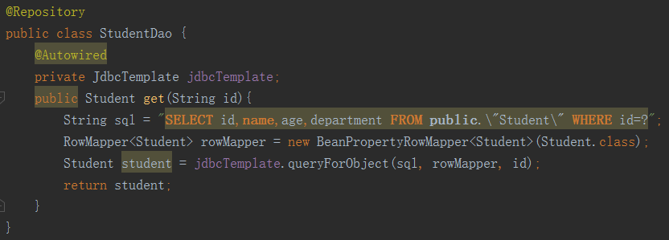

# Spring4 Study Notes

## 一、Spring Helloworld

实体类

```java
public class HelloWorld {
    private String name;

    public HelloWorld() {
        System.out.println("constructor");
    }
    public void setName(String name) {
        System.out.println("set name");
        this.name = name;
    }
    public void hello(){
        System.out.println("Hello "+name);
    }
}
```

**传统方式：**

```java
HelloWorld hw = new HelloWorld();
hw.setName("Jesse");
hw.hello();
```

**Spring方式：**

**1、配置xml文件**

```xml
<?xml version="1.0" encoding="UTF-8"?>
<beans xmlns="http://www.springframework.org/schema/beans"
       xmlns:xsi="http://www.w3.org/2001/XMLSchema-instance"
       xsi:schemaLocation="http://www.springframework.org/schema/beans http://www.springframework.org/schema/beans/spring-beans.xsd">
    <!--配置bean-->
    <!--IOC容器通过反射的方式使用class的全类名创建对象，id作为其标识-->
    <bean id="helloWorld" class="com.wangchuncheng.spring.beans.HelloWorld">
        <!--配置属性值,name value-->
        <property name="name" value="Spring"></property>
    </bean>
</beans>
```

**2、使用IOC容器**

```java
//applicationContext代表IOC容器
ApplicationContext ctx = new ClassPathXmlApplicationContext("ApplicationContext.xml");
//2、从IOC容器中获取Bean示例
HelloWorld helloWorld = (HelloWorld) ctx.getBean("helloWorld");
//say hello
helloWorld.hello();
```

**优点：低耦合、高重用率等**

## 二、配置Bean

#### **1、配置形式**

- 基于xml文件的方式

- 基于注解的方式

#### **2、基于xml配置Bean**

##### 1） 通过全类名（反射）

```xml
<bean id="helloWorld" class="com.wangchuncheng.spring.beans.HelloWorld">
    <property name="name" value="Spring"></property>
</bean>
```

##### 2） 通过工厂方法（静态工厂方法、示例工厂方法）

**a、静态工厂方法类**

```java
public class StaticCarFactory {
    private static Map<String,Car> cars = new HashMap<String, Car>();
    static {
        cars.put("audi",new Car("audi","Shangqi",300000,240));
        cars.put("ford",new Car("ford","GM",400000,250));
    }
    //静态工厂方法
    public static Car getCar(String name){
        return cars.get(name);
    }
}
```

配置bean

```xml
<bean class="com.wangchuncheng.spring.beansfactory.StaticCarFactory"
      id="car1"
      factory-method="getCar">
    <constructor-arg value="audi"/>
</bean>
```

b、实例工厂方法

```java
public class InstanceCarFactory {
    private Map<String,Car> cars = null;
    public InstanceCarFactory(){
        cars = new HashMap<String, Car>();
        cars.put("audi",new Car("audi","Shangqi",300000,240));
        cars.put("ford",new Car("ford","GM",400000,250));
    }
    public Car getCar(String brand) {
        return cars.get(brand);
    }
}
```

配置bean

```xml
<bean class="com.wangchuncheng.spring.beansfactory.InstanceCarFactory"
      id="carFactory">
</bean>
<bean id="car2" factory-bean="carFactory" factory-method="getCar">
    <constructor-arg value="ford"/>
</bean>
```

**两种工厂方法的区别**

静态工厂方法：不需要配置工厂，直接配置bean

示例工厂方法：先配置bean工厂，再配置bean

##### 3） FactoryBean

实现FactoryBean<T>接口来自定义FactoryBean

```java
public class CarFactoryBean implements FactoryBean<Car> {
    private String brand;
    public void setBrand(String brand) {
        this.brand = brand;
    }
    public Car getObject() throws Exception {
        return new Car(brand,"Huachen",500000,260);
    }
    public Class<?> getObjectType() {
        return Car.class;
    }
    public boolean isSingleton() {
        return true;
    }
}
```

和静态工厂方法相似，可以使用FactoryBean直接配置bean

虽然class 指向FactoryBean的全类名，但返回的却是其getObject方法返回的实例

```xml
<bean class="com.wangchuncheng.spring.factorybean.CarFactoryBean"
      id="car">
    <property name="brand" value="BMW"/>
</bean>
```

#### 3、基于注解配置bean

##### **1）、spring组件扫描**：

Spring能够从classpath下自动扫描、侦测和实例化具有特定注解的组件。特定组件包括：

> @Component：基本注解，标识了一个受Spring管理的组件
>
> @Repository：标识持久层组件
>
> @Service：标识服务层组件（业务层）组件
>
> @Controller：标识表现层组件

对于扫描到的组件，**Spring有默认的命名策略：使用非限定类名，第一个字母小写。也可以在注解中通过value属性标识组件的名称。**

##### 2）、配置组件扫描

当在组件类上使用了特定的注解之后，还需要在Spring配置文件中声明<context:component-scan >:

- base-package属性指定一个需要扫描的基类包
- 当需要扫描多个包时，可以用逗号隔开
- 可以使用resource-pattern指定扫描资源
- < context:include-filter> : 子节点表示要包含的目标类;使用时需指定component-scan的**use-default-filters="false"**
- < context:exclude-filter> : 子节点表示要排除的目标类

context:include-filter和context:exclude-filter子节点支持多种类型的过滤表达式：

| 类别       | 示例                   | 说明                                                         |
| ---------- | ---------------------- | ------------------------------------------------------------ |
| annotation | com.wang.XxxAnnotation | 该类型采用目标类是否标注了某个注解而进行过滤。               |
| assignable | com.wang.XxxService    | 该类型采用目标类是否继承或扩展某个类而进行过滤。             |
| aspectj    | com.wang..*Service+    | 所有类名以Service结束的类以及继承或扩展它们的类              |
| regex      | com.\wang\.anno..*     | 该类型使用正则表达式根据类名进行过滤。所有com.wang.anno下的类 |
| custom     | com.wang.XxxTypeFilter | 采用XxxTypeFilter通过代码的方式定义过滤规则，须实现TypeFilter接口 |

**举例**

```xml
<context:component-scan base-package="com.wangchuncheng.spring.annotation"
                        resource-pattern="repository/*.class">
    <context:exclude-filter type="annotation" 		expression="org.springframework.stereotype.Service"/>
    <context:exclude-filter type="..." expression="..."/>
</context:component-scan>
```

##### 3）组件装配

<context:component-scan >元素会自动注册AutowiredAnnotationBeanPostProcessor实例，该实例可以自动装配具有**@Autowired**、**@Resource**和**@Inject**注解的属性

- **@Autowired**：该注解自动装配具有兼容类型的单个Bean属性

   - 构造器，普通字段，一切具有参数的方法都可以应用
   - 默认情况下，所有使用@Autowired注解的属性都需要被设置，当Spring找不到匹配的bean装配时，会抛出异常。若某一属性允许不被设置时，可以更改@Autowired注解的**required属性为false**。
   - 默认情况下，当IOC容器里存在多个类型兼容的bean时，通过类型的自动装配将无法工作。此时可以在@Qualifier注解里提供bean的名称，Spring允许对方法的参数标注@Qualifier注解指定bean的名称
   - @Autowired还可以应用在**数组**、**集合**、**Map**属性上，此时Spring会把**所有**匹配的bean进行自动装配。其中map是将bean的名称作为键，bean本身作为值来装配。

- **@Resource**：和@Autowired功能相似，但要求提供一个bean的名称属性
- **@Inject**：和@Autowired功能相似，也是按类型匹配，但没有required属性

#### **4、两种类型的IOC容器实现**

- **Bean Factory**：IOC的基本实现，是Spring框架的基础设施，面向Spring本身

- **ApplicationContext**：提供了更多高级特性，是BeanFactory的子接口。面向使用Spring框架的开发者，**几乎所有的应用场合都直接使用ApplicationContext而非底层的BeanFactory**

  *Note：无论使用哪种形式，xml配置一致*

  ApplicationContext的主要实现类

  > ClassPathXmlApplicationContext：从类路径加载配置文件
  >
  > FlieSystemXmlApplicationContext：从文件系统加载配置文件
  >
  > WebApplicationContext：专门为Web应用而准备的

  接口关系如下：


#### **5、获取Bean**

接口BeanFactory中定义了多个getBean方法；如：

```java
ctx.getBean("helloworld");
ctx.getBean(HelloWorld.class);
......
```

#### **6、属性注入的方式**

- **property注入(最常用)**

  属性注入即通过setter方法注入Bean的属性值（Property标签）或依赖对象

  ```java
  <bean id="helloWorld" class="com.wangchuncheng.spring.beans.HelloWorld">
      <!--配置属性值,name value-->
      <property name="name" value="Spring"></property>
  </bean>
  ```

  **属性引用Bean**

  引用外部bean

  ```xml
  <!-- 需配置一个id为car的bean -->
  <property name="car" ref="car"/>
  <!-- 也可以这样写 -->
  <property name="car">
      <ref bean="car"/>
  </property>
  ```

  引用外部bean

  ```xml
  <property name="car">
      <bean class="com.wangchuncheng.Car">
      	...
      </bean>
  </property>
  ```

  赋null值

  ```xml
  <property name="car">
  	<null/>
  </property>
  ```

  级联赋值

  ```xml
  <property name="car.price" value="300000" />
  ```

  集合属性赋值<list><set>

  ```xml
  <property name="cars">
      <list>
          <ref bean="car"/>
          <ref bean="car1"/>
          <ref bean="car2"/>
      </list>
  </property>
  ```

  Properties属性

  ```xml
  <property name="properties">
      <props>
          <prop key="user">root</prop>
          <prop key="pwd">1234</prop>
          <prop key="jdbcUrl">jdbc:mysql://test</prop>
          <prop key="driverClass">com.mysql.jdbc.Driver</prop>
      </props>
  </property>
  ```

- **构造器注入**

  实体类Car

  ```
  public class Car {
      private String brand;
      private String corp;
      private int price;
      private int maxSpeed;
      public Car(String brand, String corp, int price, int maxSpeed) {
          this.brand = brand;
          this.corp = corp;
          this.price = price;
          this.maxSpeed = maxSpeed;
      }
  }
  ```

  **通过构造方法配置bean属性,可以指定type,index来区分重载的构造器**

  ```xml
  <bean id="car" class="com.wangchuncheng.spring.beans.Car" >
      <constructor-arg index="0" value="Audi"/>
      <constructor-arg index="1"/>
      	<!-- 如果字面值包含特殊字符可以使用<![CDATA[]]包含起来 -->
      	<value> <![CDATA[<ShangHai>]] </value>
      <constructor-arg index="2" value="300000"/>
      <constructor-arg index="3" value="250" />
  </bean>
  ```

- p名称空间

  ```xml
  <bean id="person1"
        class="com.wangchuncheng.spring.beans.Person"
        p:name="Jessie"
        p:age="30"
        p:car-ref="car"/>
  ```

- 工厂方法注入（很少使用）

#### 7、整合多个配置文件


## 三、自动装配

**Spring IOC容器可以自动装配Bean，需要在<bean>标签的autowire属性中指定。**

需装配的目标bean：car,address。

```xml
<bean id="address" class="com.wangchuncheng.spring.autowire.Address">
    <property name="city" value="Chengdu"/>
    <property name="street" value="Chunxilu"/>
</bean>
<bean class="com.wangchuncheng.spring.beans.Car" id="car">
    <constructor-arg index="0" value="Audi"/>
    <constructor-arg index="1" value="Shangqi"/>
    <constructor-arg index="2" value="250000"/>
    <constructor-arg index="3" value="240"/>
</bean>
```

#### 1、**byType**（根据类型自动装配）：

byType根据目标bean类型和当前bean的属性的类型进行自动装配，但是无法在有多个同类bean的情况下完成自动装配。

#### 2、**byName**(根据名称自动装配)：

byName根据bean名字和当前bean的setter风格属性名进行自动装配，注意必须将目标bean的名称和属性名设置得完全相同。

```xml
<bean class="com.wangchuncheng.spring.autowire.Person"
      id="person"
      p:name="Jesse"
      autowire="byName">
      <!--使用autowire，下述属性自动装配，无需手动配置-->
      <!--p:car-ref="car"-->
      <!--p:address-ref="address"-->
</bean>
```

#### 3、**constructor**(通过构造器自动装配)：

当Bean中存在多个构造器时比较复杂，不好用。

#### 缺点：

自动装配使得配置文档不够明确清晰

一旦使用自动装配，所有属性都需要自动装配。

不能同时使用byType和byName不灵活

## 四、Bean之间的关系

#### 1、继承

使用bean的parent属性指定被继承的bean id

```xml
<bean class="com.wangchuncheng.spring.autowire.Address"
      id="address"
      p:city="Chengdu"
      p:street="Chunxilu"/>
<bean id="address2"
      parent="address"
      p:street="Yulinlu"/>
<!-- address2继承address的city属性Chengdu -->
```

可设置bean的**abstract=true**将Bean设置为不可实例，只能被继承。

#### 2、依赖

使用bean的depend-on属性指定要依赖的bean id

```xml
<!--要求在配置Person是，必须存在一个car，换句话说这个bean依赖于car这个bean-->
<bean id="person"
      class="com.wangchuncheng.spring.autowire.Person"
      p:name="Tom" p:address-ref="address"
      depends-on="car"/>
```

## 五、Bean的作用域

#### 1、singleton：

单例的，默认方式。每次都返回同一个对象。创建容器时创建一个对象。

#### 2、prototype：

原型的。每次获取bean都返回全新的对象，获取Bean时才创建实例。


## 六、使用外部配置文件

**以配置DataSource为例**

#### 1、编写属性文件

```properties
user=root
password=1230
url=jdbc:mysql:///test
driverclassname=com.mysql.jdbc.Driver
```

#### 2、导入属性文件

spring config 中导入配置文件，使用**context**命名空间

```xml
<context:property-placeholder location="classpath:db.properties"/>
```

#### 3、使用外部属性文件

使用**${}**引用

```xml
<context:property-placeholder location="classpath:db.properties"/>
<bean class="org.springframework.jdbc.datasource.DriverManagerDataSource" id="dataSource">
    <property name="url" value="${url}"/>
    <property name="username" value="${user}"/>
    <property name="password" value="${password}"/>
    <property name="driverClassName" value="${driverclassname}"/>
</bean>
```

## 七、Spring SpEL

**Spring表达式语言**（简称**SpEL**）：是一个支持**运行时查询和操作对象图的强大表达式语言。**SpEL为bean的属性进行动态赋值提供了便利。

#### 1、作用

> 通过bean的id对bean进行引用
>
> 调用方法以及引用对象中的属性
>
> 计算表达式的值
>
> 正则表达式的匹配

#### 2、如何使用

##### 基本语法

- 字面量表示

```xml
<!-- 整数 -->
<property name="count" value="#{5}"/>
<!-- 小数 -->
<property name="frequency" value="#{89.7}"/>
<!-- 科学计数法 -->
<property name="capacity" value="#{1e7}"/>
<!-- 字符串 -->
<property name="name" value="#{'Jesse'}"/>
<!-- 布尔值 -->
<property name="enabled" value="#{false}"/>
```

显然如果只是字面值，使用SpEL的意义不大

- 引用其他对象

```xml
<!-- 通过value属性和SpEL配置bean之间的应用关系 -->
<property name="prefix" value="#{prefixGenerator}"/>
```

- 引用其他对象的属性

```xml
<!-- 通过value属性和SpEL配置suffix属性为另一个bean的suffix属性 -->
<property name="suffix" value="#{prefixGenerator.suffix}"/>
```

- 调用其他方法，还可以链式操作

```xml
<!-- 通过value属性和SpEL配置suffix属性为另一个bean的方法返回值 -->
<property name="prefix" value="#{prefixGenerator.toString()}"/>
```

##### SpEL支持的运算符

| 运算符类型         | 运算符                      |
| ------------------ | --------------------------- |
| 数学运算符         | +,-,*,/,%,^                 |
| 字符串连接         | +                           |
| 比较运算符         | <,>,==,<=,>=,lt,gt,eq,le,ge |
| 逻辑运算符         | and,or,not,！               |
| if-else运算符      | :?(temary),?:(Elvis)        |
| 正则表达式         | matches '正则表达式'        |
| 调用静态方法或属性 | T()                         |

举例

```xml
<!--算术运算符-->
<property name="area" value="#{T(java.lang.Math).PI*circle.radius^2}"/>
<!--字符串连接-->
<property name="name" value="#{''+person.lastName+person.firstName}"/>
<!--比较运算符-->
<property name="equal" value="#{counter.total==100}"/>
<!--逻辑运算符-->
<property name="outOfStock" value="#{not product.available}"/>
<!--if-else-->
<construtor-arg
value="#{selector.selectSong()=='Jingle Bells' ? piano : 'Jingle Bells'}"/>
<!--正则表达式-->
<construtor-arg
value="#{admin.email.matches'[a-zA-Z0-9._%+-]+@[a-zA-Z0-9.-]+\\.[a-zA-Z]{2,4}'}"/>
<!--调用静态方法或属性-->
<property name="initValue" value="#{T(java.lang.Math).PI}"/>
```

## 八、IOC容器中bean的生命周期

Spring IOC 容器可以管理Bean的生命周期，Spring允许在Bean生命周期的特定点执行定制的任务。

#### 1、生命周期


**如何指定生命周期方法**

通常我们声明的bean是没有init，destroy方法的，我们可以在Spring配置文件中使用**init-method**和**destroy-method**指定初始化和销毁的生命周期方法

```xml
<bean class="com.wangchuncheng.spring.lifecycle.Car"
      id="car"
      init-method="onInit"
      destroy-method="destroy">
    <property name="brand" value="Audi"/>
</bean>
```

#### 2、Bean后置处理器

spring提供了一后置处理器，允许我们在initMethod执行前后进行一些处理。我们可以通过实现**BeanPostProcessor**接口来使用。

1、编写**BeanPostProcessor**

```java
public class MyBeanPostProcessor implements BeanPostProcessor {
    //initMethod 之前调用
    public Object postProcessBeforeInitialization(Object o, String s) throws BeansException {
        System.out.println("postProcessBeforeInitialization:"+o+","+s);
        return o;
    }
     //initMethod 之后调用
    public Object postProcessAfterInitialization(Object o, String s) throws BeansException {
        System.out.println("postProcessAfterInitialization:"+o+","+s);
        return o;
    }
}
```

可以看到，上面的两个方法都有两个参数，和返回值

**Object o** : bean实例

**String s** :  IOC中bean的名字

**返回值**：是实际上返回给用户的bean，**注意：可以在以上两个方法中修改返回的bean**，甚至返回一个新的bean

2、配置**BeanPostProcessor**

配置时无需指定id，IOC容器会自动识别为后置处理器

```xml
<bean class="com.wangchuncheng.spring.lifecycle.MyBeanPostProcessor"/>
```

执行效果


## 九、Spring 4.0新特性

### 1、泛型依赖注入

Spring4.x中可以为子类注入子类对应的泛型类型的成员变量的引用。将在开发上面给我们节省很多时间。


比如在上面的UML图中，泛型BaseService中声明了对泛型BaseRepository的引用，当我们在使用它的子类如UserService（继承自BaseService<User>）时，Spring会注入与之相应的UserRepository（继承自BaseRepository<User>）。

## 十、AOP基础

#### 1、Why AOP

我们以这样一个计算器应用为例：


存在的问题

- 我们在传统开发(OOP)中，经常会在代码中嵌入许多非业务需求的代码（比如日志和验证等），使本来的业务方法急剧膨胀，每个方法在处理核心逻辑是还必须兼顾其他多个关注点。这样就造成了**代码混乱**的问题。
- **代码分散**：以日志需求为例, 只是为了满足这个单一需求, 就不得不在多个模块（方法）里多次重复相同的日志代码. **如果日志需求发生变化, 必须修改所有模块.** 

要解决上述问题，我们可以使用**动态代理**的设计模式，即使用一个代理将对象包裹起来，但是这样实现还是比较复杂。而使用Spring AOP框架在解决上述问题时，使用起来会非常简单。

#### 2、AOP简介

AOP(Aspect  oriented programming)即**面向切面编程**。AOP的主要编程对象是**切面**（Aspect）,而切面模块化**横切关注点**。在应用 AOP 编程时, 仍然需要**定义公共功能,** 但可以明确的定义这个功能在哪里, 以什么方式应用, 并且**不必修改受影响的类**. 这样一来**横切关注点就被模块化到特殊的对象(切面)**里. 

**AOP的好处**：

- 每个事物逻辑位于一个位置, 代码不分散, 便于维护和升级 
- 业务模块更简洁, **只**包含核心业务代码 

**横切关注点**：还是以计算器应用为例。


#### 3、AOP术语

- 切面(Aspect):  **横切关注点(跨越应用程序多个模块的功能)被模块化的特殊对象**

- 通知(Advice):  **切面必须要完成的工作**

- 目标(Target): **被通知的对象**

- 代理(Proxy): **向目标对象应用通知之后创建的对象**

- 连接点（Joinpoint）：**程序执行的某个特定位置**：如类某个方法调用前、调用后、方法抛出异常后等。

  连接点由两个信息确定：

  - 方法表示的程序执行点；
  - 相对点表示的方位。

  例如 ArithmethicCalculator#add() 方法执行前的连接点，执行点为 ArithmethicCalculator#add()； 方位为该方法执行前的位置

- 切点（pointcut）：**每个类都拥有多个连接点**：例如 ArithmethicCalculator 的所有方法实际上都是连接点，即**连接点是程序类中客观存在的事务。AOP 通过切点定位到特定的连接点。类比：连接点相当于数据库中的记录，切点相当于查询条件。**切点和连接点不是一对一的关系，一个切点匹配多个连接点，切点通过 org.springframework.aop.Pointcut 接口进行描述，它使用类和方法作为连接点的查询条件。

#### 4、AspectJ

**aspectJ**是目前最流行的AOP框架，在Spring2.0以上版本中，可以使用基于AspectJ注解或者基于XML配置的AOP。

##### 1、基于注解的方式

1）引入AspectJ依赖

2）配置AspectJ自动代理

```xml
<aop:aspectj-autoproxy></aop:aspectj-autoproxy>
```

3）声明一个切面类，放入IOC容器中，再标注为切面（即@Component@Aspect）

4）在切面类中声明各种通知。见下节。

##### 2、基于配置文件

1）引入AspecJ依赖

2）声明切面类和通知方法

3）将目标类和切面类引入IOC容器

4）在配置文件中配置AOP

```xml
<!--配置AOP-->
<aop:config>
    <!--配置切点-->
    <aop:pointcut id="pointcut" expression="execution(public int com.wangchuncheng.aop.basexml.ArithmeticCalculator.*(..)))"/>
    <!--配置切面-->
    <aop:aspect ref="loggingAspect" order="1">
        <!--配置通知-->
        <aop:before method="beforeMethod" pointcut-ref="pointcut"/>
        <aop:after method="afterMethod" pointcut-ref="pointcut"/>
    </aop:aspect>
</aop:config>
```

#### 5、AOP通知

| 通知类型 | 标注             | 说明                                                         |
| -------- | ---------------- | ------------------------------------------------------------ |
| 前置通知 | @Before          | 在方法执行之前执行                                           |
| 后置通知 | @After           | 在方法执行之后执行(无论是否发生异常)，还不能得到执行结果     |
| 返回通知 | @AfterReturnning | 在方法正常执行并返回结果之后执行，可以访问返回值             |
| 异常通知 | @AfterThrowing   | 在方法抛出异常之后执行                                       |
| 环绕通知 | @Around          | 围绕着方法执行。相当于动态代理。需携带ProceedingJoinPoint 参数，必须有返回值 |

**@Before举例**：

```java
@Aspect
@Component
public class LoggingAspect {
    @Before("execution(public int ArithmeticCalculator.*(int ,int ))")
    public void beforeMethod(JoinPoint joinPoint) {
        String methodName = joinPoint.getSignature().getName();
        List<Object> args = Arrays.asList(joinPoint.getArgs());
        System.out.println("The method "+methodName+" begins with "+args);
    }
}
```

**@AfterReturnning举例**

```java
@AfterReturning(value = "declareJointPointExpression()", returning = "result")
public void afterRunningMethod(JoinPoint joinPoint, Object result) {
    System.out.println("The method "
                       +joinPoint.getSignature().getName()
                       +" returns with "+result);
}
```

**@AfterThrowing举例**

```java
@AfterThrowing(value = "declareJointPointExpression()", throwing = "e")
public void afterThrowing(JoinPoint joinPoint, Exception e) {
    System.out.println("The method "
                       + joinPoint.getSignature().getName()
                       + " throws " 
                       + e.getStackTrace());
}
```

**@Around举例**

```java
@Around("declareJointPointExpression()")
public Object aroundMethod(ProceedingJoinPoint proceedingJoinPoint) {
    Object result = null;
    String methodName = proceedingJoinPoint.getSignature().getName();
    try {
        //前置通知
        System.out.println("The method " + methodName + " begins with " + Arrays.asList(proceedingJoinPoint.getArgs()));
        //执行目标方法
        result = proceedingJoinPoint.proceed();
        //返回通知
        System.out.println("The method " + methodName + " ends with " + result);
    } catch (Throwable e) {
        //异常通知
        System.out.println("The method " + methodName + " occurs exception:" + e);
        throw new RuntimeException(e);
    }
    //后置通知
    System.out.println("The method " + methodName + " ends");
    return result;
}
```

#### 6、切面优先级

可以在切面类上使用@Order指定切面的优先级，值越小，优先级越高

#### 7、切点表达式

声明切点表达式方便我们重用切点

1）定义一个空方法

2）给方法添加@Pointcut标注

3）用方法名替代通知标注里的execution()表达式

例如：

```java

@Aspect
@Component
public class LoggingAspect {
    @Pointcut("execution(public int com.wangchuncheng.aop.notification.ArithmeticCalculator.*(..))")
	public void declareJointPointExpression() {}
    @Before("declareJointPointExpression()")
    public void beforeMethod() {
        System.out.println("before");
    }
}
```

## 十一、Spring对JDBC的支持

#### 1、JDBC Template

- 为了使 JDBC 更加易于使用, Spring 在 JDBC API 上定义了一个抽象层, 以此建立一个 JDBC 存取框架.
- 作为 Spring JDBC 框架的核心, JDBC Template的设计目的是为不同类型的 JDBC 操作提供模板方法. 每个模板方法都能控制整个过程, 并允许覆盖过程中的特定任务. 通过这种方式, 可以在尽可能保留灵活性的情况下, 将数据库存取的工作量降到最低.
- JdbcTemplate 类被设计成为**线程安全的**, 所以可以再 IOC 容器中声明它的单个实例, 并将这个实例注入到所有的 DAO 实例中. 

**模板方法**

| 模板方法                      | 作用                |
| ----------------------------- | ------------------- |
| update()                      | 用SQL语句更新数据库 |
| batchUpdate()                 | 批量更新            |
| query()                       | 查询多行            |
| queryForObject()              | 单例查询            |
| queryForList()、queryForMap() | 返回数据结构的查询  |
| execute                       | 执行语句            |

**使用示例**

配置jdbc template数据源

```xml
<bean id="jdbcTemplate" class="org.springframework.jdbc.core.JdbcTemplate">
    <property name="dataSource" ref="datasource"/>
</bean>
```

使用jdbc template



#### 2、Jdbc Dao Support

Spring提供了一个JdbcDaoSupport的类，我们可以同过继承它来方便我们编写DAO类。

使用起来和直接使用JDBC Template差不多，**不推荐使用**。

**举例：**


#### 3、在 JDBC 模板中使用具名参数 

- 在经典的 JDBC 用法中, SQL 参数是用占位符 ? 表示,并且受到位置的限制. 定位参数的问题在于, 一旦参数的顺序发生变化, 就必须改变参数绑定. 
- 在 Spring JDBC 框架中, 绑定 SQL 参数的另一种选择是使用具名参数(named parameter). 
- 具名参数: SQL 按名称(以冒号开头)而不是按位置进行指定. 具名参数更**易于维护**, 也提升了可读性. 具名参数由框架类在运行时用占位符取代
- 具名参数只在 NamedParameterJdbcTemplate 中得到支持 

```java
public void testNamedParameterJdbcTemplate(){
    String sql = "INSERT INTO \"Student\"(id,name,age,department) VALUES (:id,:name,:age,:deptid)";
    Map<String, Object> paraMap = new HashMap<String, Object>();
    paraMap.put("id","12");
    paraMap.put("name","Jack");
    paraMap.put("age",35);
    paraMap.put("deptid",1);
    namedParameterJdbcTemplate.update(sql,paraMap);
}
```

## 十二、Spring事务管理

#### 1、事务简介

- 事务管理是企业级应用程序开发中必不可少的技术,  用来确保数据的**完整性**和**一致性**. 

- 事务就是一系列的动作, 它们被当做一个单独的工作单元. 这些动作要么全部完成, 要么全部不起作用

- 事务的四个关键属性(ACID)

  原子性(atomicity)、一致性(consistency)、隔离性(isolation)、持久性(durability) 

#### 2、spring的实现

**1）Spring的事务管理**

- 作为企业级应用程序框架, **Spring 在不同的事务管理 API 之上定义了一个抽象层.** 而应用程序开发人员不必了解底层的事务管理 API, 就可以使用 Spring 的事务管理机制.**有了这些事务机制, 事务管理代码就能独立于特定的事务技术了** 
- Spring 既支持编程式事务管理, 也支持声明式的事务管理. 
  - **编程式事务管理: 将事务管理代码嵌入到业务方法中来控制事务的提交和回滚.** 在编程式管理事务时, 必须在每个事务操作中包含额外的事务管理代码. 
  - **声明式事务管理**: 大多数情况下比编程式事务管理更好用. 它**将事务管理代码从业务方法中分离出来, 以声明的方式来实现事务管理**. 事务管理作为一种横切关注点, 可以通过 AOP 方法模块化. **Spring 通过 Spring AOP 框架支持声明式事务管理*.

**2）Spring事务管理器**

​	Spring 的核心事务管理抽象是                     它为事务管理封装了一组独立于技术的方法. 无论使用 Spring 的哪种事务管理策略(编程式或声明式), 事务管理器都是必须的. 

**3）Spring 中的事务管理器的不同实现** 

- ：在应用程序中只需要处理一个数据源, 而且通过 JDBC 存取
-                             : 在 JavaEE 应用服务器上用 JTA(Java Transaction API) 进行事务管理
-                                   
- ：用 Hibernate 框架存取数据库
- ……
- 事务管理器以普通的 Bean 形式声明在 Spring IOC 容器中

#### 3、使用步骤

1）配置事务管理器

```xml
<bean id="dataSourceTransactionManager" class="org.springframework.jdbc.datasource.DataSourceTransactionManager">
    <property name="dataSource" ref="datasource"/>
</bean>
```

2）启用事务注解

```xml
<tx:annotation-driven transaction-manager="dataSourceTransactionManager"/>
```

3）在事务操作的方法上标注@Transactional

```java
@Service
public class BookShopServiceImpl implements BookShopService {
    @Autowired
    private BookShopDao bookShopDao;
    @Transactional
    public void purchase(String username, String isbn) {
        //1、获取书的单价
        double price = bookShopDao.findBookPriceByIsbn(isbn);
        //2、更新书的库存
        bookShopDao.updateBookStock(isbn);
        //3、更新用户余额
        bookShopDao.updateUserAcount(username,price);
    }
}
```

#### 4、事务的属性

**1）事务属性的指定方式**

使用标注


使用文件配置


**2）事务的传播行为（propagation）**

当事务方法被另一个事务方法调用时, 必须指定事务应该如何传播. 例如: 方法可能继续在现有事务中运行, 也可能开启一个新事务, 并在自己的事务中运行。事务的传播行为可以由传播属性指定. Spring 定义了 7  种类传播行为. 


**3）事务的隔离级别（Isolation）**

从理论上来说, 事务应该彼此完全隔离, 以避免并发事务所导致的问题. 然而, 那样会对性能产生极大的影响, 因为事务必须按顺序运行。在实际开发中, 为了提升性能, 事务会以较低的隔离级别运行。事务的隔离级别可以通过事务的**isolation**属性指定 。Spring支持的事务隔离级别：


*事务的隔离级别要得到底层数据库引擎的支持, 而不是应用程序或者框架的支持.*

*Oracle 支持的 2 种事务隔离级别：READ_COMMITED , SERIALIZABLE；Mysql 支持 4 种事务隔离级别。*

**4）事务的回滚（rollbackFor/noRollbackFor  ）**

**默认情况下只有未检查异常**(RuntimeException和Error类型的异常)**会导致事务回滚**. 而受检查异常不会。事务的回滚规则可以通过事务的 rollbackFor 和 noRollbackFor 属性来定义。这两个属性被声明为 Class[] 类型的, 因此可以为这两个属性指定多个异常类. 

> rollbackFor:  遇到时必须进行回滚
>
> noRollbackFor: 一组异常类，遇到时必须不回滚

**5）超时（readOnly）和只读（timeout）属性**

- 由于事务可以在行和表上获得锁,  因此长事务会占用资源, 并对整体性能产生影响. 
- 如果一个事物只读取数据但不做修改, 数据库引擎可以对这个事务进行优化.
  - **超时事务属性**: 事务在强制回滚之前可以保持多久. 这样可以防止长期运行的事务占用资源.
  - **只读事务属性**: 表示这个事务只读取数据但不更新数据, 这样可以帮助数据库引擎优化事务.